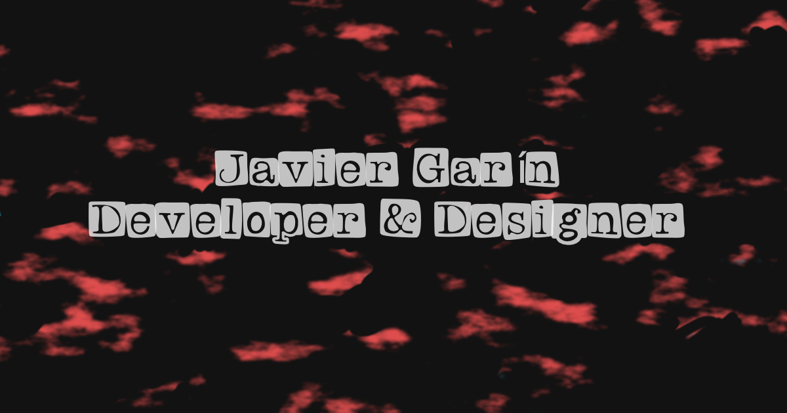

# Portafolio Personal con Three.js

¡Bienvenido a mi portafolio personal! Este proyecto es una demostración interactiva de mis habilidades en desarrollo web, combinando modelos 3D con animaciones fluidas para crear una experiencia de usuario única.

## 🚀 Descripción

Este portafolio está construido como una Single Page Application (SPA) utilizando JavaScript puro, **Three.js** para el renderizado de gráficos 3D y **GSAP** para las animaciones. El objetivo es presentar mi trabajo y habilidades de una manera visualmente atractiva e innovadora.

## 📸 Captura de Pantalla

Así es como se ve el proyecto en acción:

## 🛠️ Tecnologías Utilizadas

*   **HTML5** y **CSS3** para la estructura y el estilo.
*   **JavaScript (ES6+)** como lenguaje principal de la lógica.
*   **Three.js** para la creación y manipulación de la escena 3D.
*   **GSAP (GreenSock Animation Platform)** para las animaciones de la cámara y los elementos de la interfaz.

## ✍️ Autor

Este proyecto fue desarrollado con ❤️ por **JavGarin**.